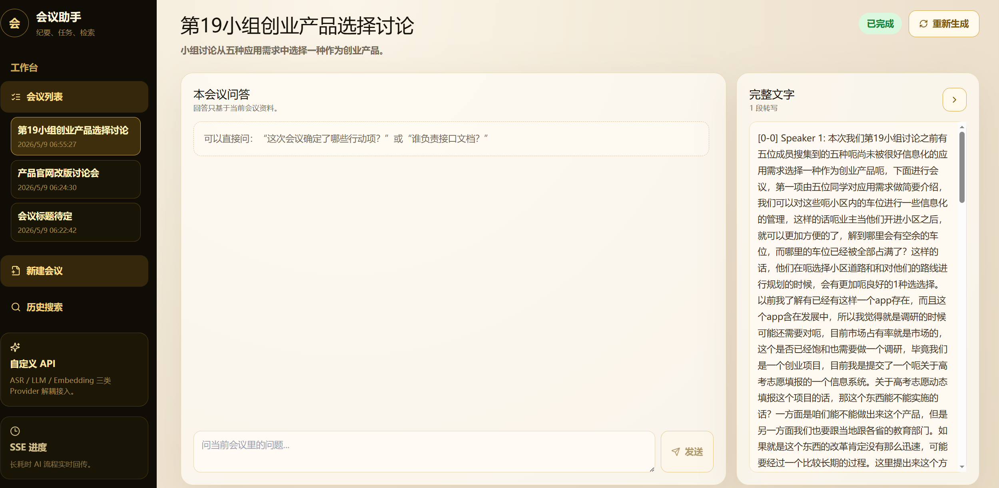

# AI 会议助手

一个前后端分离的会议知识工作台。系统支持上传会议音频或文本，自动完成转写、摘要生成、说话人映射、会议内问答和历史语义检索，适合课堂讨论、项目例会、访谈整理和产品评审等场景。

## 核心能力

- 上传 `.mp3`、`.wav`、`.m4a`、`.txt` 会议材料后自动进入处理流程。
- 通过 ASR Provider 生成带时间戳的音频内容，支持不同 Speaker 标签解析。
- 基于 LLM Provider 生成会议标题、描述、摘要、关键点和结论。
- 进入会议后可以进行本会议内问答，回答只基于当前会议资料。
- 侧边栏内置可滚动会议列表，可快速切换会议。
- 支持 Speaker 到真实参会人的手动映射。
- 支持历史会议语义检索，方便跨会议查找内容。
- 内置 Mock Provider，没有真实 API Key 时也能跑通主要流程。

## 界面预览

### 会议问答工作台

左侧为可滚动会议列表，中间为当前会议问答，右侧展示完整转写内容。



### 新建会议

支持填写标题、描述、参会人名单，上传音频或文本后自动启动 AI 处理。


### 处理进度

上传后进入处理页，左侧展示处理事件、参会人和 Speaker 映射，右侧只保留音频内容与摘要。


### 摘要结果

处理完成后可查看摘要，并点击下一步进入会议问答。


## 技术栈

后端：

- FastAPI
- SQLAlchemy
- SQLite
- Pydantic
- ChromaDB
- LangGraph / LangChain
- Server-Sent Events

前端：

- React 19
- TypeScript
- Vite
- TailwindCSS
- React Router
- lucide-react

## 目录结构

```txt
backend/      FastAPI 后端服务
frontend/     React 前端应用
docs/         设计文档
uploads/      上传文件目录
chroma_db/    本地向量数据库
测试/         README 截图与测试素材
```

## 本地运行

### 后端

```bash
cd backend
python -m venv .venv
.venv\Scripts\activate
pip install -r requirements.txt
copy .env.example .env
uvicorn app.main:app --reload --port 8000
```

后端接口文档：`http://localhost:8000/docs`

### 前端

```bash
cd frontend
npm install
npm run dev
```

前端访问地址：`http://localhost:5173`

Vite 已配置 `/api` 代理到 `http://localhost:8000`。

## 第三方 API 配置

复制 `backend/.env.example` 为 `backend/.env`，按需填写：

```env
ASR_PROVIDER=custom
ASR_API_KEY=your_asr_api_key
ASR_API_BASE_URL=https://your-asr-provider.example.com/transcribe
ASR_MODEL=your-asr-model

LLM_PROVIDER=openai_compatible
LLM_API_KEY=your_llm_api_key
LLM_API_BASE_URL=https://your-llm-provider.example.com/v1
LLM_MODEL=your-chat-model

EMBEDDING_PROVIDER=openai_compatible
EMBEDDING_API_KEY=your_embedding_api_key
EMBEDDING_API_BASE_URL=https://your-embedding-provider.example.com/v1
EMBEDDING_MODEL=your-embedding-model
```

如果未配置 API Key，系统会使用 Mock Provider 兜底。说话人分离依赖 ASR 服务返回 Speaker 信息；如果上游只返回整段文本，系统会默认显示 `Speaker 1`。

## Docker Compose

```bash
docker compose up --build
```

前端：`http://localhost:5173`

后端：`http://localhost:8000/docs`

## 常见流程

1. 在左侧点击 `新建会议`。
2. 上传音频或文本材料。
3. 等待处理进度到 100%。
4. 查看音频内容和摘要。
5. 点击 `下一步` 进入会议问答。
6. 在右侧完整文字辅助下，对当前会议进行追问。

## 注意事项

- 音频说话人分离效果取决于 ASR 服务能力。
- 历史语义检索依赖 Embedding Provider 和本地 ChromaDB 索引。
- 本地开发时，后端需要先启动，否则前端 API 请求会失败。
